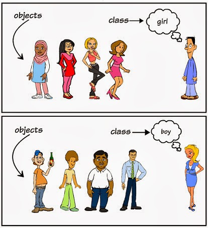
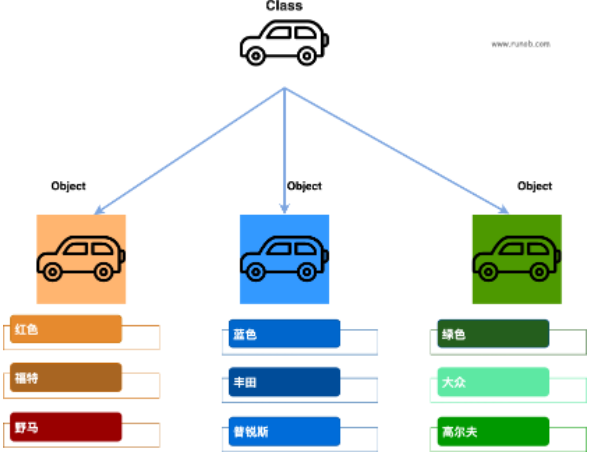

## Python基础

#### 基础类型

##### Number（数字）

```python
# int 
a = 1
b = 1.0
c = "123"
a = int(b)
a = int(c)
# float
a = 1.0
b = 1
c = "1.23"
a = float(b)
a = float(c)
```


##### String（字符串）

```python
# str
s1 = "0123456“
# 获取字符串的子串
s2 = s1[0:2]
s2 = s1[:2]
s2 = s1[1:]
s2 = s1[:]
s2 = s1[2:-1]
s2 = s1[-3:-1]
#获取字符串的对应字符
s2 = s1[2]
#字符串去除首尾指定字符
s3 = s1.strip()
# 字符串分割成列表
s4 = s1.split("")
# 替代
s1.replace("a","b")
# 返回指定子串在字符串中的出现位置，没有找到就返回-1
s1.find(str_child)
# 返回指定子串在该字符串中第一次出现的索引，没有找到就抛出异常
s1.index(str_child)
# 返回指定子串在该字符串中出现的次数
s1.count(str_child)
```


##### List（列表）

```python
# 列表定义
a = [1,2,3]
a = list()
# 访问元素
b = a[2]
c = a[0:2]
# 添加元素
b = 1
a.append(b)
# 删除元素
del a[2]
# 列表大小
len(a)
# 列表排序
a.sort(key=lambda x: x[1], reverse=True)# list类型内置方法
sorted(a)# 可迭代的序列排序生成新的序列
```


##### Tuple（元组）

```python
# 元组定义
a = (1,"",3.0)
a = tuple()
b = 1
c = 2
a = (b,c)
b = ((1,2),(3,4))
list1 = [(data,label),(data,label)]
val1,val2 = a
for data,label in list1:
    pass
# 注意：元组中只包含一个元素时，需要在元素后面添加逗号，否则括号会被当作运算符使用
a = (b,)
# 元组中的元素值是不允许修改的，但我们可以对元组进行连接组合
tup1 = (12, 34.56)
tup2 = ('abc', 'xyz')
tup3 = tup1 + tup2
# tuple大小
len1 = len(tup3)
```


##### Set（集合）

```python
# 集合定义
a = {1,2}
a = set()
# 添加元素
b = 1
a.add(b)
# 删除元素
a.remove(b)
```


##### Dictionary（字典）

```python
# 字典定义
a = {}
a = dict()
a = {"1":111,"2":"aaa"}
# 删除键 '1'
del a['1']
# 清空字典
a.clear()
# 字典转键/值列表
keys = list(a.keys())
values = list(a.values())
```


#### 基础语法

##### 运算符

```python
# 按位运算符
a = 0011 1100
b = 0000 1101
a&b = 0000 1100  # 按位与
a|b = 0011 1101  # 按位或
a^b = 0011 0001  # 按位异或
~a  = 1100 0011  # 按位取反

#逻辑运算符
a = b and c #与&&
a = b or c  #或||
a = not b   #非！

```

##### if条件语句

```python
if condition_1:
    pass
elif condition_2:      
    pass
else:
    pass
if a<b:
if a>b:
if a and b:
if not in list
```

| `<`  | 小于                     |
| ---- | ------------------------ |
| `<=` | 小于或等于               |
| `>`  | 大于                     |
| `>=` | 大于或等于               |
| `==` | 等于，比较两个值是否相等 |
| `!=` | 不等于                   |

##### for循环

```python
for i in range(5):
    pass
```


##### while循环

```python
while condition_1:
    pass
```


##### def函数定义

```python
def func_1(m,key=1,*args,**keys):
    def func_2(args):
        pass
    func_2(1)
    a = 1
def func_2(s,b,c):
    print(s)
    a = 1
    d = "123"
    if s>0:
        return a+b
    else:
        return d
def func_3(m,key=1):
    print(m)
    a = 1
def func_4(m,key=1,*args,**keys):
    print(m)
    print(key)
    print(args)
    print(keys)
    if "x" in list(keys.keys()):
        print(keys["x"])
if __name__ == "__main__":
    func_1(1,2,key=1)
    func_2(1,2,3)
    func_2(s=1,b=2,c=3)
```


##### try错误处理

```python
try:
    a = 1
except:
    print(a)
    
```


##### import模块

```python
import json
import os,sys
from PyQt5.QtWidgets import QApplication, QWidget, QLabel
__all__ = [] # 字符串列表，存储本文件中可被导入的模块名称
```


### 类和对象

#### 面向对象技术简介

- **类(Class):** 用来描述具有相同的属性和方法的对象的集合。它定义了该集合中每个对象所共有的属性和方法。对象是类的实例。
- **方法：**类中定义的函数。
- **类变量：**类变量在整个实例化的对象中是公用的。类变量定义在类中且在函数体之外。类变量通常不作为实例变量使用。
- **其他变量：**其他非类属性的变量。
- **实例化：**创建一个类的实例，类的具体对象。
- **对象：**通过类定义的数据结构实例。对象包括两个数据成员（类变量和实例变量）和方法。
- **继承：**即一个派生类（derived class）继承基类（base class）的字段和方法。继承也允许把一个派生类的对象作为一个基类对象对待。例如，有这样一个设计：一个Dog类型的对象派生自Animal类，这是模拟"是一个（is-a）"关系（例图，Dog是一个Animal）。

- **方法重写：**如果从父类继承的方法不能满足子类的需求，可以对其进行改写，这个过程叫方法的覆盖（override），也称为方法的重写。
- **局部变量：**定义在方法中的变量，只作用于当前实例的类。
- **实例变量：**在类的声明中，属性是用变量来表示的，这种变量就称为实例变量，实例变量就是一个用 self 修饰的变量。

和其它编程语言相比，Python 在尽可能不增加新的语法和语义的情况下加入了类机制。

Python中的类提供了面向对象编程的所有基本功能：类的继承机制允许多个基类，派生类可以覆盖基类中的任何方法，方法中可以调用基类中的同名方法。

对象可以包含任意数量和类型的数据。

#### 概念

- **类**：类是一个模板，它描述一类对象的行为和状态**（属性和操作）**。
- **对象**：对象是类的一个实例，有状态和行为。例如，一条狗是一个对象，它的状态**（属性）**有：颜色、名字、品种；行为**（函数）**有：摇尾巴、叫、吃等。





#### 类定义

语法格式如下：

```python
class ClassName:
    # 定义基本属性
    public_value = ''
    value = ""
    # 定义私有属性,私有属性在类外部无法直接进行访问
    __private_value = 0
    __value = 0
    # 构造方法，该方法在类实例化时会自动调用
    # self代表类的实例，而非类
    def __init__(self):
        self.data = []
    # 类的方法有一个额外的第一个参数名称, 按照惯例它的名称是 self
    def public_func(self):
        print(self)
        print(self.__class__)
    # 两个下划线开头，声明该方法为私有方法，只能在类的内部调用 ，不能在类的外部调用
    def __private_func(self):
        pass
```

#### 构造对象

```python
class ClassName:
    # 构造方法，该方法在类实例化时会自动调用
    def __init__(self,n,data):
        self.name = n
        self.data = data
        self.__value = len(n)
    # 两个下划线开头，声明该方法为私有方法，只能在类的内部调用 ，不能在类的外部调用
    def __func(self):
        print(self.__class__)
    # 类的方法有一个额外的第一个参数名称, 按照惯例它的名称是 self
    def func(self):
        print(self)
        self.__func()
# 构造类的对象并赋值给obj变量进行使用
obj = ClassName("Li Hua",[1,2,3])
# 获取对象的属性值
obj.name
list1 = obj.data
# 无法使用对象访问类的私有方法
obj.__func()
# 使用对象的方法
obj.func()
```

#### 继承

##### 单继承

```python
class people:
    #定义基本属性
    name = ''
    age = 0
    #定义私有属性,私有属性在类外部无法直接进行访问
    __weight = 0
    #定义构造方法
    def __init__(self,n,a,w):
        self.name = n
        self.age = a
        self.__weight = w
    def people_func(self):
        pass
 
#单继承示例
class student(people):
    grade = ''
    #定义基本属性
    name = ''
    age = 0
    #定义私有属性,私有属性在类外部无法直接进行访问
    __weight = 0
    def __init__(self,n,a,w,g):
        #调用父类的构造函数
        people.__init__(self,n,a,w)# super(student,self).__init__(n,a,w)
        self.grade = g
    def people_func(self):
        super(student,self).people_func()
        pass
    def student_func(self):
        pass
a = student()
super(student,a).people_func()
```


##### 多继承

```python
class people:
    #定义属性
    name = ''
    age = 0
    __weight = 0
    #定义构造方法
    def __init__(self,n,a,w):
        self.name = n
        self.age = a
        self.__weight = w

class speaker():
    topic = ''
    name = ''
    def __init__(self,n,t):
        self.name = n
        self.topic = t
 
#多重继承
class sample(speaker,student):
    a =''
    def __init__(self,n,a,w,g,t):
        student.__init__(self,n,a,w,g)
        speaker.__init__(self,n,t)
```


##### 方法重写

```python
class Parent:        # 定义父类
   def myMethod(self):
      print('调用父类方法')
 
class Child(Parent): # 定义子类
   def myMethod(self):
      print('调用子类方法')

class Children(Parent): # 定义子类
   def myMethod(self):
      super().myMethod()# 调用父类方法
      print('调用子类方法')
 
c = Child()          # 子类实例
c.myMethod()         # 子类调用重写方法
super(Child,c).myMethod() #用子类对象调用父类已被覆盖的方法 super(type, obj)
c = Children()          # 子类实例
c.myMethod()         # 子类调用重写方法
```

#### Python内置类属性

- **_ _ dict _ _** : 类的属性（包含一个字典，由类的数据属性组成）
- **_ _ doc _ _** :类的文档字符串
- **_ _ name _ _**: 类名
- **_ _ module _ _**: 类定义所在的模块（类的全名是'_ _ main_ _ .className'，如果类位于一个导入模块mymod中，那么className._ _ module_ _  等于 mymod）
- **_ _ bases _ _**: 类的所有父类构成元素（包含了一个由所有父类组成的元组）

#### Python内置类的专有方法：

- **_ _ init _ _ :** 构造函数，在生成对象时调用 class()
- **_ _ del _ _ :** 析构函数，释放对象时使用  del
- **_ _ repr _ _ :** 打印，转换 print
- **_ _ setitem _ _:** 按照索引赋值 []=
- **_ _ getitem _ _:** 按照索引获取值 []
- **_ _ len _ _:** 获得长度 
- **_ _ cmp _ _:** 比较运算  sorted()
- **_ _ call _ _:** 函数调用 object()
- **_ _ add _ _:** 加运算 +
- **_ _ sub _ _:** 减运算 -
- **_ _ mul _ _:** 乘运算 *
- **_ _ truediv _ _:** 除运算 /
- **_ _floordiv _ _:** 整除运算 //
- **_ _ mod _ _:** 求余运算 %
- **_ _ pow _ _:** 乘方 **

#####  反向算术运算符的重载:

​            方法名                  运算符和表达式       说明
​            __radd__(self,lhs)       lhs + self       加法
​            __rsub__(self,lhs)       lhs - self       减法
​            __rmul__(self,lhs)       lhs * self       乘法
​            __rtruediv__(self,lhs)   lhs / self       除法
​            __rfloordiv__(self,lhs)  lhs // self      地板除
​            __rmod__(self,lhs)       lhs % self       取模(求余)
​            __rpow__(self,lhs)       lhs ** self      幂运算


#### 命名空间

**局部的命名空间 -> 全局命名空间 -> 内置命名空间**

##### 局部命名空间

函数中定义的名称，记录了函数的变量，包括函数的参数和局部定义的变量。（类中定义的也是）

##### 全局命名空间

```python
# var1 是全局变量
var1 = 5
def some_func():
    # var2 是局部变量
    var2 = 6
    def some_inner_func():
        # var3 是内嵌的局部变量
        var3 = 7
if True:
    a = 1#a 为全局变量
```


##### 内置命名空间

Python 语言内置的名称，比如函数名 abs、char 和异常名称 BaseException、Exception 等等


#### 作用域

##### 四种作用域：

- **L（Local）**：最内层，包含局部变量，比如一个函数/方法内部。
- **E（Enclosing）**：包含了非局部(non-local)也非全局(non-global)的变量。比如两个嵌套函数，一个函数（或类） A 里面又包含了一个函数 B ，那么对于 B 中的变量来说 A 中的作用域就为nonlocal。
- **G（Global）**：最外层，比如当前模块的全局变量。
- **B（Built-in）**： 包含了内建的变量/关键字等，最后被搜索。

Python 中只有模块（module），类（class）以及函数（def、lambda）才会引入新的作用域，其它的代码块不会引入新的作用域，也就是说条件/循环等语句内定义的变量，外部也可以访问。

##### 局部作用域

定义在函数内部的变量拥有一个局部作用域。

##### 全局作用域

定义在函数外的拥有全局作用域。

##### 嵌套作用域

定义在嵌套函数内部的变量拥有嵌套作用域。

##### 内置作用域

内置作用域是通过一个名为 builtin 的标准模块来实现的，但是这个变量名自身并没有放入内置作用域内，所以必须导入这个文件才能够使用它。

##### global关键字

将一个变量声明为全局变量

##### nonlocal关键字

寻找上层的局部变量，并将其声明为拥有嵌套作用域的变量
