[TOC]

### 一、包的导入

```python
import matplotlib.pyplot as plt
```

### 二、画一组点

```python
plt.plot([1,2,3,4], [1,4,9,16],'ro')
plt.show()
```

解释：函数plot()的参数中的[1,2,3,4]是输入坐标点的x轴，[1,4,9,16]是输入坐标的y轴，‘ro’为可选参数，是一个字符串来定义图的基本属性如：颜色（color），点型（marker），线型（linestyle），其中的‘r’指的是颜色为红色，'o'指的是点型为圆点。

##### 颜色


##### 点型


##### 线型


#### 详解：

##### 1、plot()函数包括多个参数

每组图像输入参数为三个，依次分别为x轴数据的数组，y轴数据的数组，属性字符串。其中，x轴数组和y轴数组的元素个数必须相同。属性字符串为空时，默认为蓝色实线。当携带表示线型的参数时，画出的图为折线。因此，当输入所有输入的y都是由y=f(x)函数求得时，输出的图像为直线。

```python
import matplotlib.pyplot as plt
plt.plot([1,2,3,4],[1,4,9,16])
plt.show()
```

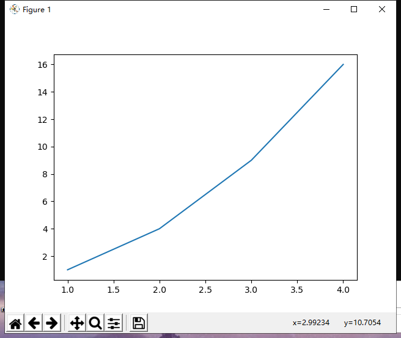

```python
import matplotlib.pyplot as plt
x=[1,2,3,4]
y=[]#y为一个list元素
for xi in x:
  yi=xi*2
  y.append(yi)
plt.plot(x,y)
plt.show()
```

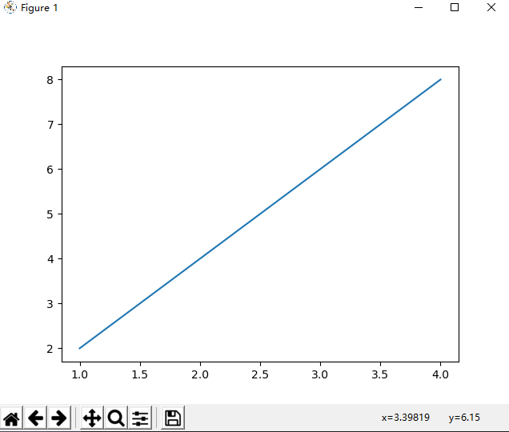

##### 2、也可以同时画多组图形

在一个plot()函数中可以写入多组参数，即可画出多组图形

```python
import matplotlib.pyplot as plt
x=[1,2,3,4]
y1=[]
for xi in x:
  yi=xi*2
  y1.append(yi)
y2=[3,4,5,6]
y3=[0.5,6,0.9,7]
y4=[1,2,3,4]
plt.plot(x,y1,'go-',x,y2,'rx',x,y3,'*',x,y4,'b-.')
plt.show()
```

### 三、画一个函数图像

[matplotlib—画正弦、余弦函数图]: https://blog.csdn.net/MESSI_JAMES/article/details/80819144

#### 1、sin函数

```python
import numpy as np#导入numpy包，numpy为常用与数学计算相关的包
import matplotlib.pyplot as plt
X = np.linspace(-np.pi, np.pi * 2, 1000)#获取1000个-π到2π的均匀连续点在numpy中详细介绍
Y_sin = np.sin(X)#获取x对应的sin值
plt.plot(X, Y_sin,c="r",lw=5,ls="-")
#plt.plot(X, Y_sin,'r-'',lw=5)#lw:linewidth
#plt.plot(X, Y_sin,color="r",linewidth=5,linestyle="-")
plt.show()
```

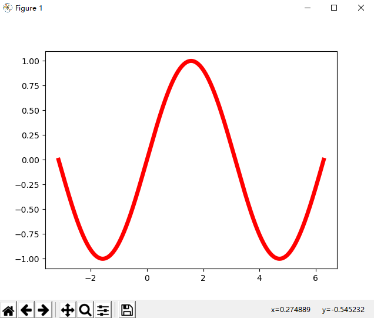

调节x轴和y轴的长度

```python
plt.xlim(X.min()*1.5,X.max()*1.5)
plt.ylim(cos.min()*1.5,cos.max()*1.5)
```

调节x轴和y轴的刻度

```python
plt.xticks([-np.pi,-np.pi/2,0,np.pi/2,np.pi],[r'$-\pi$',r'$-\pi/2$',r'$0$',r'$\pi/2$',r'$\pi$'])
plt.yticks([-1,0,1])
```

获取Axes对象隐藏右边界和上边界

```python
ax=plt.gca()
ax.spines['right'].set_color('none') 
ax.spines['top'].set_color('none')
```

调解x轴和y轴坐标轴刻度的位置

```python
ax.xaxis.set_ticks_position('bottom')
ax.spines['bottom'].set_position(('data',0))
```

平移坐标轴

```python
ax.yaxis.set_ticks_position('left')
ax.spines['left'].set_position(('data',0))
```

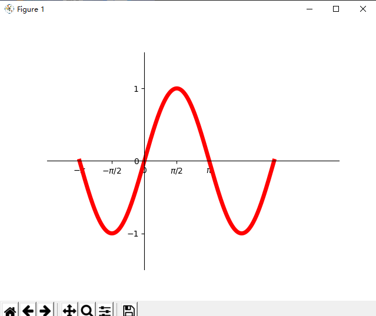

### 四、画统计图

#### 1、绘制直方图

```python
#################随机生成一组数据#######################
import pandas as pd
import numpy as np
import random
data = np.zeros((100,100),dtype=int)
for i in range(len(data)):#这里速度比较慢，因为随机给100*100的数组赋值
    for j in range(len(data[0])):
        data[i][j] = random.randint(1,20)#赋值的范围是1-20中的任意一个
###################使用构造的数据绘制直方图#####################
import matplotlib.pyplot as plt
bins=[1,2,3,4,5,6,7]
plt.hist(data[0],bins=bins,rwidth=0.8)
plt.show()
```

**运行结果**

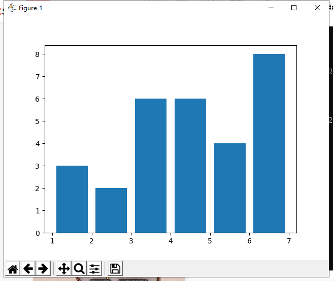

**参数详解**

`hist(x, bins=None, range=None, normed=False, weights=None, cumulative=False, bottom=None, histtype='bar', align='mid', orientation='vertical', rwidth=None, log=False, color=None, label=None, stacked=False, hold=None, data=None, **kwargs)`

**x**——数组或（允许长度不等的）数组序列

**bins**——整数值或序列。如果bins为整数值，则bins为柱子个数，根据数据的取值范围和柱子个数bins计算每个柱子的范围值，柱宽=(x.max()-x.min())/bins；如果bins取值为序列，则该序列给出每个柱子的范围值（如[1,2,3,4]就确定了三个柱子范围[1,2)、[2,3)、[3,4]），除最后一个柱子外，其他柱子的取值范围均为半开（左闭右开）。

range——元组(tuple)或None。剔除较大和较小的离群值，给出全局范围。如果为None，则默认为(x.min(), x.max())。如果bins取值为序列，则range无效，python会基于bins的取值画图。

density——布尔值。如果为true，则返回的元组的第一个参数frequency将为频率而非默认的频数。可自行验证sum(frequency)。

weights——与x形状相同的权重数组。将x中的每个元素乘以对应权重值再计数。如果normed或density取值为True，则会对权重进行归一化处理。这个参数可用于绘制已合并的数据的直方图。

cumulative——布尔值。如果为True，则计算累计频数。如果normed或density取值为True，则计算累计频率。

bottom——数组，标量值或None。每个柱子底部相对于y=0的位置。如果是标量值，则每个柱子相对于y=0向上/向下的偏移量相同。如果是数组，则根据数组元素取值移动对应的柱子。

histtype——类型包括{'bar', 'barstacked', 'step', 'stepfilled'}。默认为'bar'，是传统的条形直方图；'barstacked'是堆叠的条形直方图；'step'是未填充的条形直方图，只有外边框；'stepfilled'是有填充的直方图。当histtype取值为'step'或'stepfilled'，rwidth设置失效，即不能指定柱子之间的间隔，默认连接在一起。

**step**

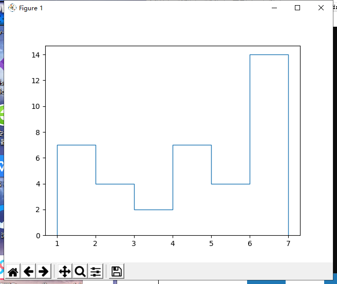

**stepfilled**

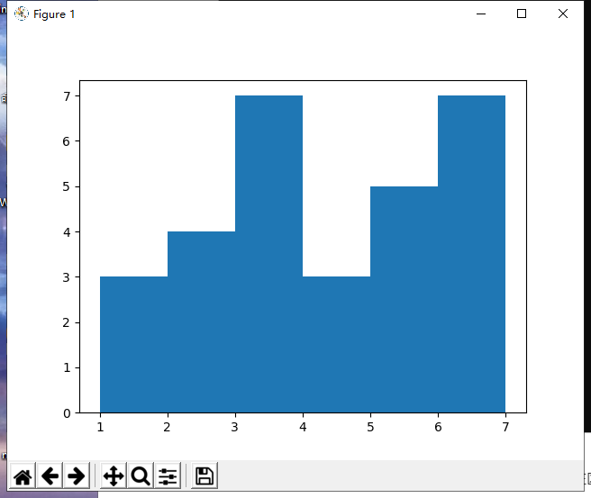

**align**——{'left', 'mid', 'right'}。'left'：柱子的中心位于bins的左边缘；'mid'：柱子位于bins左右边缘之间；'right'：柱子的中心位于bins的右边缘。

orientation——{'horizontal', 'vertical'}：如果取值为horizontal，则条形图将以y轴为基线，水平排列。

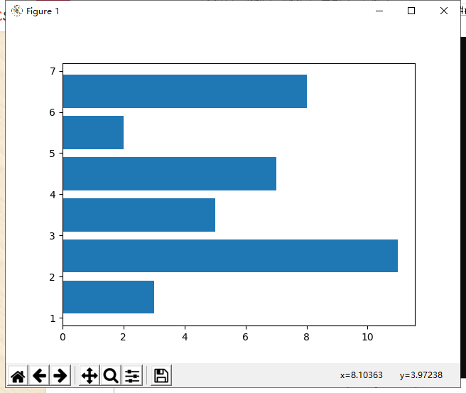

**rwidth**——标量值或None。柱子的宽度占bins宽的比例，默认为1，上面的例子取值均为0.8

log——布尔值。如果取值为True，则坐标轴的刻度为对数刻度。如果log为True且x是一维数组，则计数为0的取值将被剔除，仅返回非空的(frequency, bins, patches）。

color——具体颜色，数组（元素为颜色）或None。

label——字符串（序列）或None。有多个数据集时，用label参数做标注区分。

**stacked**——布尔值。如果取值为True，则输出的图为多个数据集堆叠累计的结果，见下图；如果取值为False且histtype='bar'或'step'，则多个数据集的柱子并排排列，见下图。

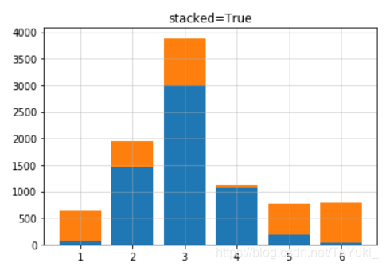

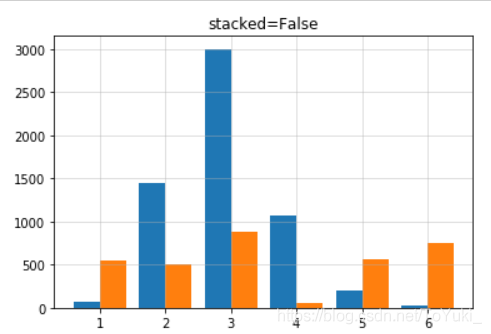

normed：布尔值。官方不推荐使用，建议改用density参数。

**其他可用参数：**

1. `color`  *指定填充色*
2. `edgecolor`*指定直方图的边界色*
3. `label `*指定直方图的标签*

**返回的参数：**

frequency（官方文档用n表示）：数组或数组列表。柱子的高，即频数或频率值，数据类型为float。

bins：每个柱子的左右边缘值（即区间范围）

patches：列表或列表的列表，取值为每个柱子包含的数据

#### 2、密度图

### 五、构建包含多个子图的图

```python
plt.subplot(221)
plt.subplot(222)
plt.subplot(223)
plt.subplot(224)
plt.show()
```

另一种写法

```python
fig = plt.figure(figsize=(6, 6))
fig.add_subplot(221)
fig.add_subplot(222)
fig.add_subplot(223)
fig.add_subplot(224)
plt.show()
```

解释：subplot()函数格式`subplot(numRows, numCols, plotNum)`三个参数均小于10时可以省略逗号，其中，**numRows**为子图的行数，**numCols**为子图的列数，**plotNum**为子图的编号，编号顺序：从左到右，从上到下。

figure()函数为图像对象格式为`figure(num=None, figsize=None, dpi=None, facecolor=None, edgecolor=None, frameon=True, FigureClass=Figure, clear=False, **kwargs)`

**num**——这个参数是一个可选参数，即可以给参数也可以不给参数。可以将该num理解为窗口的属性id,即该窗口的身份标识。如果不提供该参数，则创建窗口的时候该参数会自增，如果提供的话则该窗口会以该num为Id存在。

**figsize**——可选参数。整数元组，默认是无。提供整数元组则会以该元组为长宽，若不提供，默认为 rc fiuguer.figsize例如（4，4）即以长4英寸 宽4英寸的大小创建一个窗口。

**dpi**——可选参数，整数。表示该窗口的分辨率，如果没有提供则默认为 figure.dpi。

**facecolor**——可选参数，表示窗口的背景颜色，如果没有提供则默认为figure.facecolor其中颜色的设置是通过RGB，范围是'#000000'~'#FFFFFF'，其中每2个字节16位表示RGB的0-255例如'#FF0000'表示R:255 G:0 B:0 即红色。

**edgecolor**——可选参数，表示窗口的边框颜色，如果没有提供则默认为figure,edgecolor。

**frameon**——可选参数，表示是否绘制窗口的图框，默认是true

**figureclass**——图像的类型

**clear**——可选参数，默认是false,如果提供参数为ture，并且该窗口存在的话 则该窗口内容会被清除。

**kwargs——省略参数的标志，在此处不必展开详解，直接忽略即可

### 六、保存文件

```python
plt.savefig(path)
```

一般需要先于show()，不然可能出现保存的图片当中没有内容的情况。

```python
import matplotlib.pyplot as plt

plt.figure('one')

#2行1列，第1个
plt.subplot(2,1,1)
plt.plot([1,2,3] , [3,5,1],label='label1')

#添加x轴标题
plt.xlabel('name',fontsize=14, color='green')
#添加y轴标题
plt.ylabel('age')
#添加标题
plt.title('hello world')
#添加文本注释
plt.text(2, 2, 'hey,look at me')
#另一个添加注释的函数为annotate
#plt.annotate('local max', xy=(1.25, 3), xytext=(3, 1.5),arrowprops=dict(facecolor='black', shrink=0.05),)

#显示图例
plt.legend()

#显示网格线
plt.grid(True)

#2行1列，第2个
plt.subplot(2,1,2)
plt.plot([1,2,3] , [3,5,1],'ro')

plt.show()
```

### 七、pyplot常用的一些方法

```python
import matplotlib.pyplot as plt 
plt.figure('one')
#2行1列，第1个
plt.subplot(2,1,1)
plt.plot([1,2,3] , [3,5,1],label='label1')#lable为线的名称

#添加x轴标题
plt.xlabel('name',fontsize=14, color='green')
#添加y轴标题
plt.ylabel('age')
#添加标题
plt.title('hello world')
#添加文本注释
plt.text(2, 2, 'hey,look at me')

#显示图例
plt.legend()

#显示网格线
plt.grid(True)

#2行1列，第2个
plt.subplot(2,1,2)
plt.plot([1,2,3] , [3,5,1],'ro')

plt.show()
```

**结果展示：**

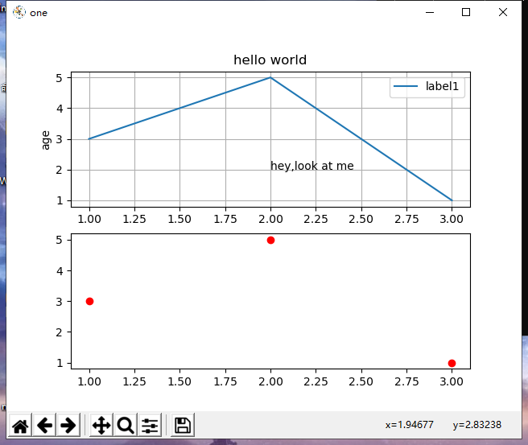

**添加文本注释的函数text的格式**

`text(x, y, s, fontdict=None,withdash=cbook.deprecation._deprecated_parameter, **kwargs)`

**说明**

x,y——为文本注释的坐标

s——为字符串代表文本注释的内容

fontdict——为字典类型定义字符串格式的字典

withdash——为bool类型默认为false，如果为true则创建一个TextWithDash实例，不常用

**其他可用参数**

1. `fontsize`设置字体大小，默认12，可选参数 [‘xx-small’, ‘x-small’, ‘small’, ‘medium’, ‘large’,‘x-large’, ‘xx-large’]
2. `fontweight`设置字体粗细，可选参数 [‘light’, ‘normal’, ‘medium’, ‘semibold’, ‘bold’, ‘heavy’, ‘black’]
3. `fontstyle`设置字体类型，可选参数[ ‘normal’ | ‘italic’ | ‘oblique’ ]，italic斜体，oblique倾斜
4. `verticalalignment`设置水平对齐方式 ，可选参数 ： ‘center’ , ‘top’ , ‘bottom’ ,‘baseline’
5. `horizontalalignment`设置垂直对齐方式，可选参数：left,right,center
6. `rotation`(旋转角度)可选参数为:vertical,horizontal 也可以为数字
7. `alpha`透明度，参数值0至1之间
8. `backgroundcolor`标题背景颜色
9. `bbox`给标题增加外框 ，常用参数如下：
   1. `boxstyle`方框外形
   2. `facecolor`(简写fc)背景颜色
   3. `edgecolor`(简写ec)边框线条颜色
   4. `edgewidth`边框线条大小

**添加标题的函数title的格式**

`title(label, fontdict=None, loc=None, pad=None, **kwargs)`

**说明**

label——字符串，标题文本

fontdict——字典型，用来控制标题的字体样式

loc——字符串，代表标题水平样式，可为{'center', 'left', 'right'}，分别表示居中，水平居左和居右，默认为水平居中。

pad——浮点型，表示标题离图表顶部的距离，默认为None.

**添加x轴标题的函数xlabel的格式**

`xlabel(xlabel, fontdict=None, labelpad=None, **kwargs)`

**说明**

与title相应参数相同

**添加y轴标题的函数ylabel的格式**

`ylabel(ylabel, fontdict=None, labelpad=None, **kwargs)`

**说明**

同xlabel

### 八、关于axex

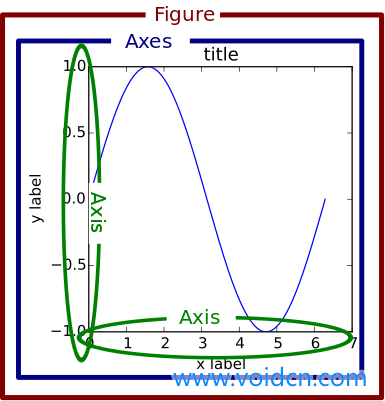

axes也可以用来绘制多图，可以说subplot其实为axes的一个特例，

```python
import matplotlib.pyplot as plt
import numpy as np
# 创建数据
dt = 0.001
t = np.arange(0.0, 10.0, dt)
r = np.exp(-t[:1000]/0.05) # impulse response
x = np.random.randn(len(t))
s = np.convolve(x, r)[:len(x)]*dt # colored noise
# 默认主轴图axes是subplot(111)
plt.plot(t, s)
plt.axis([0, 1, 1.1*np.amin(s), 2*np.amax(s)])
plt.xlabel('time (s)')
plt.ylabel('current (nA)')
plt.title('Gaussian colored noise')
#内嵌图
a = plt.axes([.65, .6, .2, .2], facecolor='y')
n, bins, patches = plt.hist(s, 400, normed=1)
plt.title('Probability')
plt.xticks([])
plt.yticks([])
#另外一个内嵌图
a = plt.axes([0.2, 0.6, .2, .2], facecolor='y')
plt.plot(t[:len(r)], r)
plt.title('Impulse response')
plt.xlim(0, 0.2)
plt.xticks([])
plt.yticks([])
plt.show()
```

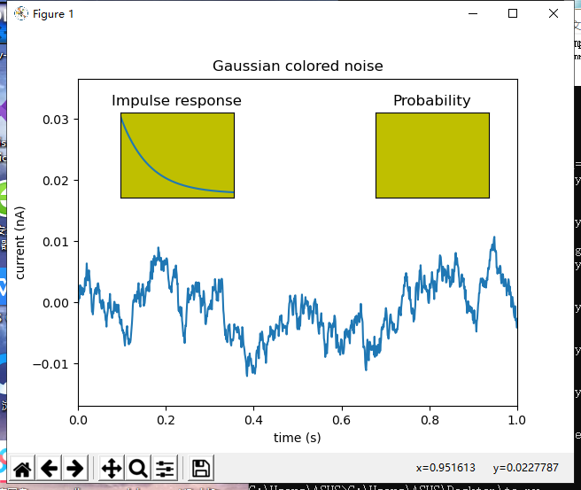

### 九、一些问题

**title()、xlabel()、ylabel()无法显示中文的解决办法**

```python
#添加相关包和字体
from matplotlib import pyplot
from matplotlib.font_manager import FontProperties
font_set = FontProperties(fname=r"c:\windows\fonts\simsun.ttc", size=15)
 
pyplot.title(u'中文', fontproperties=font_set)
pyplot.xlabel(u'中文', fontproperties=font_set)
pyplot.ylabel(u'中文', fontproperties=font_set)
```

### 十、相关函数参考表格

 [表格来源](https://blog.csdn.net/u010668279/article/details/54407772)

| 功能                                | 函数  （基于matplotlib.pyplot.） |
| ----------------------------------- | -------------------------------- |
| 设置x轴标签                         | `xlabel`(s, *args, **kwargs)     |
| 获取或设置当前轴的x限值             | `xlim`(*args, **kwargs)          |
| 设置x轴的比例                       | `xscale`(*args, **kwargs)        |
| 获取或设置当前刻度位置和标签的x限值 | `xticks`(*args, **kwargs)        |

| 功能                                | 函数  （基于matplotlib.pyplot.） |
| ----------------------------------- | -------------------------------- |
| 设置y轴标签                         | `ylabel`(s, *args, **kwargs      |
| 获取或设置当前轴的y限值             | `ylim`(*args, **kwargs)          |
| 设置y轴的比例                       | `yscale`(*args, **kwargs)        |
| 获取或设置当前刻度位置和标签的y限值 | `yticks`(*args, **kwargs)        |

| 功能                           | 函数  （基于matplotlib.pyplot.）                             |
| ------------------------------ | ------------------------------------------------------------ |
| 绘制x的自相关图像              | `acorr`(x, hold=None, data=None, \*\*kwargs)                 |
| 绘制角谱                       | `angle_spectrum`(x, Fs=None,Fc=None, window=None, pad_to=None, sides=None, hold=None, data=None, \*\*kwargs) |
| 文本注释                       | `annotate`(*args, \*\*kwargs)                                |
| 向轴添加箭头。                 | `arrow`(x, y, dx, dy, hold=None, \*\*kwargs)                 |
| 自动伸缩轴试图数据（切换）     | `autoscale`(enable=True, axis='both', tight=None)            |
| 向图表添加数据                 | `axes`(*args, \**\kwargs)                                    |
| 在轴上添加一个水平线           | `axhline`(y=0, xmin=0, xmax=1, hold=None, \*\*kwargs)        |
| 在轴上添加一个水平跨度（矩形） | `axvspan`(xmin, xmax, ymin=0, ymax=1, hold=None, \*\*kwargs) |
| 获取或设置轴属性的方便方法     | `axis`(*v, **kwargs)                                         |

| 功能                                                        | 函数  （基于matplotlib.pyplot.）                             |
| ----------------------------------------------------------- | ------------------------------------------------------------ |
| 绘制一个误差线图                                            | `errorbar`(x, y, yerr=None, xerr=None, fmt='', ecolor=None, elinewidth=None, capsize=None, barsabove=False, lolims=False, uplims=False, xlolims=False, xuplims=False, errorevery=1, capthick=None, hold=None, data=None, **kwargs) |
| 在特定的位置绘制相同的平行线                                | `eventplot`(positions, orientation='horizontal', lineoffsets=1, linelengths=1, linewidths=None, colors=None, linestyles='solid', hold=None, data=None, **kwargs) |
| 添加一个非采样图像                                          | `figimage`(*args, **kwargs)                                  |
| 在图表中放置图例                                            | `figlegend`(handles, labels, loc, **kwargs)                  |
| 向图表添加文本                                              | `figtext`(*args, **kwargs)                                   |
| 创建一个新图表                                              | `figure`(num=None, figsize=None, dpi=None, facecolor=None, edgecolor=None, frameon=True, FigureClass=<class 'matplotlib.figure.Figure'>, **kwargs) |
| 填充                                                        | `fill`(*args, **kwargs)                                      |
| 在两条曲线之间填充                                          | `fill_between`(x, y1, y2=0, where=None, interpolate=False, step=None, hold=None, data=None, **kwargs) |
| 在两条水平曲线之间填充                                      | `fill_betweenx`(y, x1, x2=0, where=None, step=None, hold=None, data=None, **kwargs) |
| 寻找artist对象                                              | `findobj`(o=None, match=None, include_self=True)             |
| 在匹配给定的关键字参数的当前图表上获取或创建一个当前轴实例  | `gca`(**kwargs)                                              |
| 获取当前数字的参考                                          | gcf( )                                                       |
| 获取当前可着色的artist                                      | gci（）                                                      |
| 返回现有图形标签的列表                                      | `get_figlabels`()                                            |
| 返回现有图表数字的列表                                      | `get_fignums`()                                              |
| 获取所有绘制命令的排序列表                                  | `get_plot_commands`()                                        |
| 使输入签名                                                  | `ginput`(*args, **kwargs)                                    |
| 打开或关闭轴网格                                            | `grid`(b=None, which='major', axis='both', **kwargs)         |
| 生成一个六边形箱图                                          | `hexbin`(x, y, C=None, gridsize=100, bins=None, xscale='linear', yscale='linear', extent=None, cmap=None, norm=None, vmin=None, vmax=None, alpha=None, linewidths=None, edgecolors='none', reduce_C_function=<function mean>, mincnt=None, marginals=False, hold=None, data=None, **kwargs) |
| 生成一个直方图                                              | `hist`(x, bins=10, range=None, normed=False, weights=None, cumulative=False, bottom=None, histtype='bar', align='mid', orientation='vertical', rwidth=None, log=False, color=None, label=None, stacked=False, hold=None, data=None, **kwargs) |
| 生成一个二维直方图                                          | `hist2d`(x, y, bins=10, range=None, normed=False, weights=None, cmin=None, cmax=None, hold=None, data=None, **kwargs) |
| 在每一个y上绘制从xmin到xmax的水平线                         | `hlines`(y, xmin, xmax, colors='k', linestyles='solid', label='', hold=None, data=None, **kwargs) |
| 设置保持状态                                                | `hold`(b=None)                                               |
| 从文件中读取图像到数组中                                    | `imread`(*args, **kwargs)                                    |
| 保存在图像文件中的数组                                      | `imsave`(*args, **kwargs)                                    |
| 在轴上显示图像                                              | `imshow`(X, cmap=None, norm=None, aspect=None, interpolation=None, alpha=None, vmin=None, vmax=None, origin=None, extent=None, shape=None, filternorm=1, filterrad=4.0, imlim=None, resample=None, url=None, hold=None, data=None, **kwargs) |
| 安装一个real,以便任何旧版本的图像自动绘制时，控制返回到repl | `install_repl_displayhook`()                                 |
| 关闭交互模式                                                | ioff( )                                                      |
| 开启交互模式                                                | ion( )                                                       |
| 返回当前轴的保持状态                                        | ishold( )                                                    |

| 功能                                           | 函数  （基于matplotlib.pyplot.）                             |
| ---------------------------------------------- | ------------------------------------------------------------ |
| 返回交互模式状态                               | isinteractive( )                                             |
| 在轴上放置一个图例                             | `legend`(*args, **kwargs)                                    |
| 控制刻度定位器的行为                           | `locator_params`(axis='both', tight=None, **kwargs)          |
| 在x轴和y轴上绘制一个日志缩放图                 | `loglog`(*args, **kwargs)                                    |
| 绘制幅度谱                                     | `magnitude_spectrum`(x, Fs=None, Fc=None, window=None, pad_to=None, sides=None, scale=None, hold=None, data=None, **kwargs) |
| 设置或检索自动缩放的边缘                       | `margins`(*args, **kw)                                       |
| 在新图形窗口中将数组作为矩阵显示               | `matshow`(A, fignum=None, **kw)                              |
| 移除当前图中的次要刻度线                       | `minorticks_off`()                                           |
| 显示当前图中的次要刻度线                       | `minorticks_on`()                                            |
| 使用hold(True)来调用一个函数                   | `over`(func, *args, **kwargs)                                |
| 暂停数秒                                       | `pause`(interval)                                            |
| 创建一个二维数组的伪彩图                       | `pcolor`(*args, **kwargs)                                    |
| 绘制四边形网格                                 | `pcolormesh`(*args, **kwargs)                                |
| 绘制相位谱                                     | `phase_spectrum`(x, Fs=None, Fc=None, window=None, pad_to=None, sides=None, hold=None, data=None, **kwargs) |
| 绘制一个饼状图                                 | `pie`(x, explode=None, labels=None, colors=None, autopct=None, pctdistance=0.6, shadow=False, labeldistance=1.1, startangle=None, radius=None, counterclock=True, wedgeprops=None, textprops=None, center=(0, 0), frame=False, hold=None, data=None) |
| 绘制线条和/或轴标记。                          | `plot`(*args, **kwargs)                                      |
| 绘制日期数据                                   | `plot_date`(x, y, fmt='o', tz=None, xdate=True, ydate=False, hold=None, data=None, **kwargs) |
| 绘制文件中的数据                               | `plotfile`(fname, cols=(0, ), plotfuncs=None, comments='#', skiprows=0, checkrows=5, delimiter=', ', names=None, subplots=True, newfig=True, **kwargs) |
| 制作一个极坐标                                 | `polar`(*args, **kwargs)                                     |
| 绘制功率谱密度                                 | `psd`(x, NFFT=None, Fs=None, Fc=None, detrend=None, window=None, noverlap=None, pad_to=None, sides=None, scale_by_freq=None, return_line=None, hold=None, data=None, **kwargs) |
| 绘制一个二维箭头                               | `quiver`(*args, **kw)                                        |
| 向抖动图中添加一个键                           | `quiverkey`(*args, **kw)                                     |
| 设置当前rc参数                                 | `rc`(*args, **kwargs)                                        |
| 返回管理RC设置的上下文管理器。                 | `rc_context`(rc=None, fname=None)                            |
| 恢复默认的rc参数                               | `rcdefaults`()                                               |
| 在极坐标图中获取或设置径向网格线               | `rgrids`(*args, **kwargs)                                    |
| 保存当前图表                                   | `savefig`(*args, **kwargs)                                   |
| 将当前轴实例设置为ax                           | `sca`(ax)                                                    |
| 绘制x和y的散点图，其中x和y是两个长度相同的序列 | `scatter`(x, y, s=20, c=None, marker='o', cmap=None, norm=None, vmin=None, vmax=None, alpha=None, linewidths=None, verts=None, edgecolors=None, hold=None, data=None, **kwargs) |
| 设置当前图像                                   | `sci`(im)                                                    |

| 功能                                      | 函数  （基于matplotlib.pyplot.）                             |
| ----------------------------------------- | ------------------------------------------------------------ |
| 在x轴上绘制带有日志缩放的图               | `semilogx`(*args, **kwargs)                                  |
| 在y轴上绘制带有日志缩放的图               | `semilogy`(*args, **kwargs)                                  |
| 设置默认的调色板                          | `set_cmap`(camp)                                             |
| 设置一个artist对象的属性                  | `setp`(*args, **kwargs)                                      |
| 显示一个图像                              | `show`(*args, **kw)                                          |
| 绘制一个谱图                              | `specgram`(x, NFFT=None, Fs=None, Fc=None, detrend=None, window=None, noverlap=None, cmap=None, xextent=None, pad_to=None, sides=None, scale_by_freq=None, mode=None, scale=None, vmin=None, vmax=None, hold=None, data=None, **kwargs) |
| 绘制二维数组的稀疏模式                    | `spy`(Z, precision=0, marker=None, markersize=None, aspect='equal', hold=None, **kwargs) |
| 绘制一个累积面积图                        | `stackplot`(x, *args, **kwargs)                              |
| 创建一个茎叶图                            | `stem`(*args, **kwargs)                                      |
| 绘制一个步骤图                            | `step`(x, y, *args, **kwargs)                                |
| 绘制一个矢量流图                          | `streamplot`(x, y, u, v, density=1, linewidth=None, color=None, cmap=None, norm=None, arrowsize=1, arrowstyle='-\|>', minlength=0.1, transform=None, zorder=1, start_points=None, hold=None, data=None) |
| 返回一条由给定的网格定位的子图轴线        | `subplot`(*args, **kwargs)                                   |
| 在网格中创建一个子图                      | `subplot2grid`(shape, loc, rowspan=1, colspan=1, **kwargs)   |
| 启动一个图表的子图工具窗口                | `subplot_tool`(targetfig=None)                               |
| 创建一个子图已经做出来了的图表            | `subplots`(nrows=1, ncols=1, sharex=False, sharey=False, squeeze=True, subplot_kw=None, gridspec_kw=None, **fig_kw) |
| 调整子图布局                              | `subplots_adjust`(*args, **kwargs)                           |
| 向图表添加一个居中的标题                  | `suptitle`(*args, **kwargs)                                  |
| 切换默认的后端                            | `switch_backend`(newbackend)                                 |
| 向当前轴添加一个表                        | `table`(**kwargs)                                            |
| 向轴添加文本                              | `text`(x, y, s, fontdict=None, withdash=False, **kwargs)     |
| 获取或设置极坐标网格线中theta的位置       | `thetagrids`(*args, **kwargs)                                |
| 改变刻度和刻度标签的外观                  | `tick_params`(axis='both', **kwargs)                         |
| 改变直线轴默认使用的标量格式              | `ticklabel_format`(**kwargs)                                 |
| 自动调整指定的填充区域的子图参数          | `tight_layout`(pad=1.08, h_pad=None, w_pad=None, rect=None)  |
| 设置当前轴的标题                          | `title`(s, *args, **kwargs)                                  |
| 绘制非结构化三角网格的轮廓                | `tricontour`(*args, **kwargs)                                |
| 填充非结构化三角网格的轮廓                | `tricontourf`(*args, **kwargs)                               |
| 创建一个非结构三角形网格伪彩色图          | `tripcolor`(*args, **kwargs)                                 |
| 画一个非结构化的三角形网格作为线和/或标记 | `triplot`(*args, **kwargs)                                   |
| 绘制一个与x轴共享的第二轴                 | `twinx`(ax=None)                                             |

| 功能                       | 函数  （基于matplotlib.pyplot.）                             |
| -------------------------- | ------------------------------------------------------------ |
| 绘制一个与y轴共享的第二轴  | `twiny`(ax=None)                                             |
| 卸载matplotlib的显示钩     | `uninstall_repl_displayhook`()                               |
| 制作一个小提琴图           | `violinplot`(dataset, positions=None, vert=True, widths=0.5, showmeans=False, showextrema=True, showmedians=False, points=100, bw_method=None, hold=None, data=None) |
| 绘制垂直线                 | `vlines`(x, ymin, ymax, colors='k', linestyles='solid', label='', hold=None, data=None, **kwargs) |
| 绘制x和y的相关图           | `xcorr`(x, y, normed=True, detrend=<function detrend_none>, usevlines=True, maxlags=10, hold=None, data=None, **kwargs) |
| 开启xkcd素描风格的绘图模式 | `xkcd`(scale=1, length=100, randomness=2)                    |